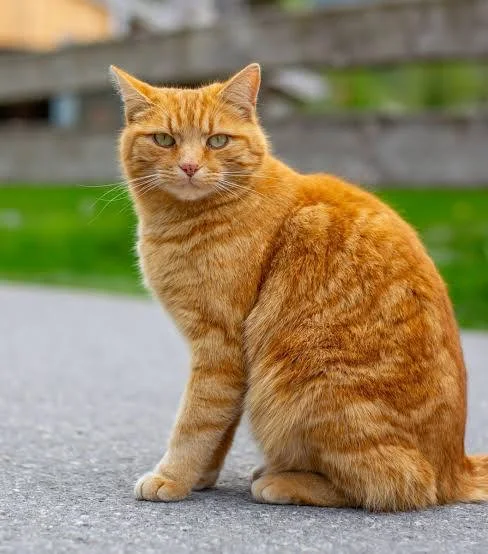

# Austin

Hi, I'm **Austin** - a Network Programmer,  Gamedev, and Computer Science student

## My Journey

I've been working remotely for several years, traveling the world while building technology solutions. My passion lies in exploring new technologies, sharing knowledge, and helping others embrace the digital nomad lifestyle.

## What I Do

- **Tech Development**: Building web applications and mobile solutions
- **Content Creation**: Sharing insights through blogs and videos
- **Community Building**: Connecting with fellow nomads and tech enthusiasts

## My Mission

To bridge the gap between technology and lifestyle, showing how digital tools can enable freedom and creativity in our modern world.

<!--  -->
